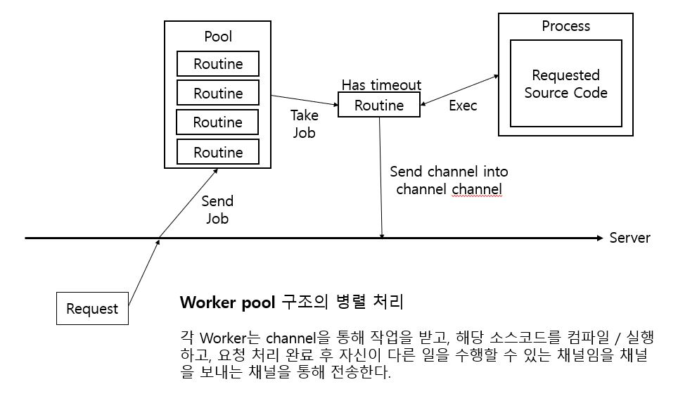
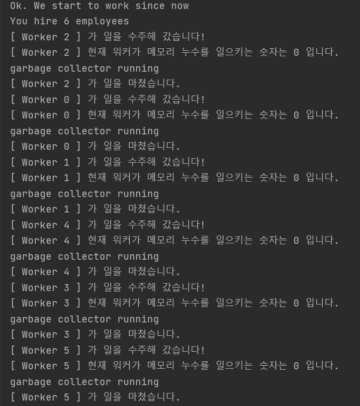

CodeRunner
==========

#### Remote code launcher.
#### This micro server can be use for developer community, education tool of programming and so on.

------------------------------

#### Worker pool architecture를 갖는 Remote code launcher 입니다.
#### 패키지로 이용하거나, Docker를 통해 MSA에서 Code 실행을 담당하는 컨테이너로 운용할 수 있습니다.
#### Timeout은 무한루프 방지를 위해 10초로 제한되어 있습니다. Worker routine은 CPU개수로 제한됩니다.


<br/><br/><br/>

Installation
----------------

For using a server
> git clone https://github.com/javatour/runserver.git


For using a package
> go get github.com/javatour/runserver


<br/><br/><br/>


Build
--------

* By using docker
```
make docker V={put tag}
docker run -i -p 3001:3001 runserver:{tag}
```


* By using go build

```
make build
```

* Just run

```
go run main.go
```

<br/><br/><br/>

Usage
--------

### Using package
Need to install Python / JRE / GCC<br/>
Please use it by docker

> Make directory "workspace" in your project root

```go
import (
    "log"
    "net/http"
    
    "github.com/javatour/runserver/worker"
)

workers, err := worker.MakeWorkers()
if err != nil {
    log.Fatal("do not use this program now. your server already busy")
}
workers.WorkStart()
http.HandleFunc("/code", workers.ServeHTTP)
```

### Using server

Send post request to under point
```
http://{hostname}:3001/code
```

```
POST json {
	Text string,
	Filename string
	Language string
}
```

Supported Language
--------

```
java
c++
python
```

Architecture
------------



Execution
---------


